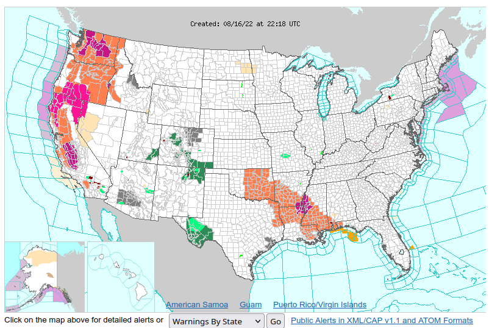
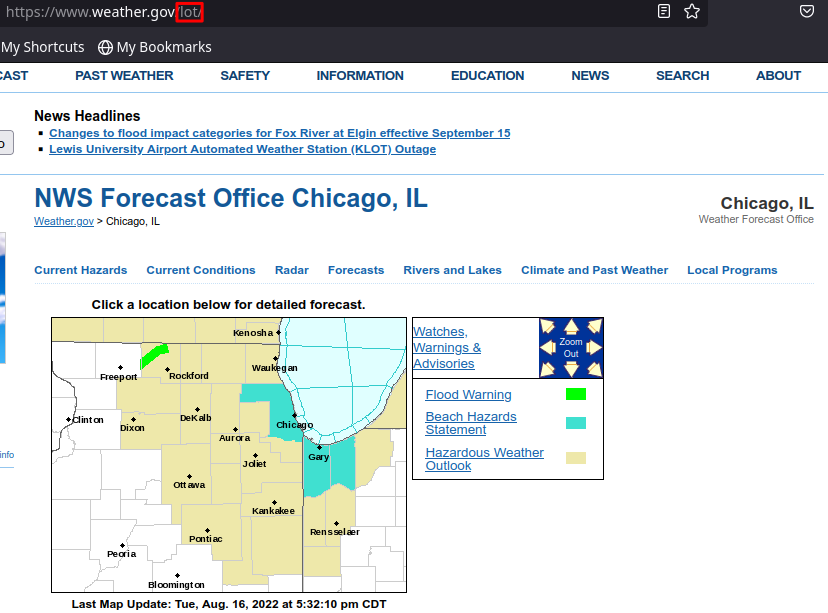
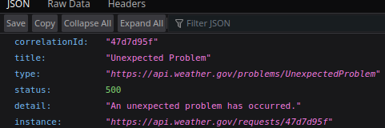

# Weather-Displayer
Displays the Weather from the National Weather Service API

```
                      ,
                      :
         '.        _______       .'
           '  _.-"`       `"-._ '
            .'                 '.
     `'--. /                     \ .--'`
          /                       \
      '   |                       |  '-.
         Sunny
Current Temperature: 79, Tonight's Temperature:
57, Wednesday's Temperature: 81
The wind: E at 10 mph.
```

## My Usecase
I'm making this to replace my Accu-Rite Weather station that broke. This will be run on a Raspberry Pi and Raspberry Pi Touchscreen

## Description of the Scripts

### main.py
The main part of the script that interprets data from the NWS API and displays it on the screen

### getter.py
In charge of getting the data from the NWS API and giving it to main.py.

### manager.sh
Shell script to execute everything as needed. You can also quit the script from manager.sh by passing the ```-q``` argument.

## Installation

### Windows
First off, this script was designed for use on Linux, specifically for the Raspberry Pi. If you wish to run it on Windows, you can clone this repo and build your own batch script. Just make sure the getter script is executed first,in a seperate thread.
You will also need to download Python 3 if you haven't already. Head over to [the Python Project's Website](https://www.python.org/) and download the latest version of Python 3.

### MacOS
I am not familiar with MacOS, nor do I have a Mac to test this on. Basically install Python and download the project.

### Linux
Not much setup should be needed on Linux, the vast majority of distros already have Python installed. But if you don't, run:

Debian: ```sudo apt install python```

Ubuntu: ```sudo apt install python3```

Red Hat/Fedora: ```sudo dnf install python3```

Arch (as root): ```pacman -S python```

From here, simply clone this repository, either with the above "Code" drop-down or with ```git clone "https://github.com/JR-Tech-and-Software/Weather-Displayer/Weather-Displayer.git"```

### All
After Python is installed and the project has been downloaded, you will need to tell the script the URL to get your local weather data. It can take multiple steps to do this.

1. Head to [the National Weather Service's Webpage](https://www.weather.gov/)
2. Click on your location on the website's big map (I'll use Chicago as an example.)

3. In the URL bar of this webpage, you should see the code of your local NWS site. In my case, it's ```lot```. Take note of this, you'll need it later.

4. Click on your more precise location.
5. Not too far nn the URL bar, you should see ```?x=``` and ```?y=```. These are your X and Y coordinates, once again take note of these. In my example, my X coordinate is 244, my Y coordinate is 100.

6. Now you can create your URL. You can test this out in your browser. Type ```api.weather.gov/gridpoints/```. Enter in your NWS Code found in step 3, but capitalized. Ex. ```lot``` would become ```LOT```.
   - Now type a ```/```, followed by your X and Y coordinates from step 5, sperated by a comma. So far we have ```api.weather.gov/gridpoints/LOT/244,100```
   - Lastly, type ```/forecast```. Go to this URL, you should see a long page of JSON data.
7. Copy this URL and put it in a file called "url". Be sure that this file doesn't have a file extension, especially if you are doing this in Windows.
8. Startup the application by executing ```manager.sh``` or your equivelent. If there are no errors, you are good to go

#### Issues


When you go to the URL in Step 6, you may run into an issue where you get an unexpected error, with the status of 500. This can happen from time to time,
this is an issue with NWS. Wait around 10 minutes and refresh the page, it should bring up your weather data. Keep doing this every so often if you get the same 500 error.
