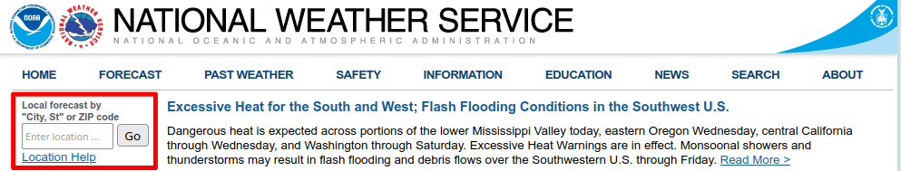
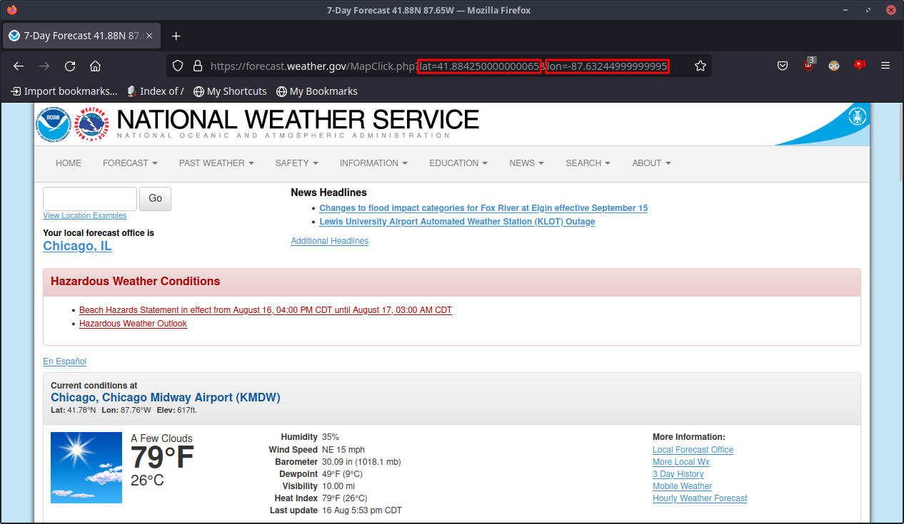
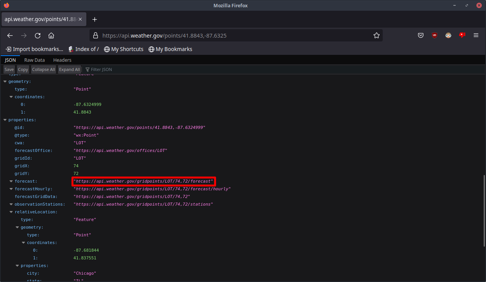
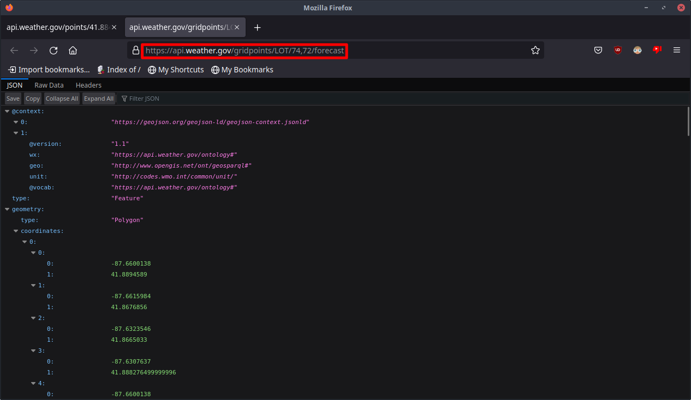

# Weather-Displayer
Displays the Weather from the National Weather Service API

```
                      ,
                      :
         '.        _______       .'
           '  _.-"`       `"-._ '
            .'                 '.
     `'--. /                     \ .--'`
          /                       \
      '   |                       |  '-.
         Sunny
Current Temperature: 79, Tonight's Temperature:
57, Wednesday's Temperature: 81
The wind: E at 10 mph.
```

## My Usecase
I'm making this to replace my Accu-Rite Weather station that broke. This will be run on a Raspberry Pi and Raspberry Pi Touchscreen

## Description of the Scripts

### main.py
The main part of the script that interprets data from the NWS API and displays it on the screen. Also in charge of getting JSON with the getter() function

### web.py
This controls the web interface, using the Flask library

## Installation
If you want the latest stable version, you can download the project from the releases section. If you want to have the "nightly" version, you can use a `git clone`
command to clone this repository and continue from there.

### Windows
First off, this script was designed for use on Linux, specifically for the Raspberry Pi. Because I did not design for Windows, and I don't plan on ever using it or testing it
with Windows, **use it at your own risk. I cannot guarantee any sort of stable functionality when running on anything other than Linux**.

You will need to download Python 3 if you haven't already. Head over to [the Python Project's Website](https://www.python.org/) and download the 
latest version of Python 3. 

After this, you need to download a program called "cowsay". After downloading Python, you can do this from the Pip package manager. After ensuring Pip is 
in your PATH environment variable, you can run ```pip install cowsay``` in an **Administrative** command line. You will also need to run ```pip install flask```
in order to install the flask library to run the web frontend, and ```pip install requests``` to install the urllib library, which downloads the JSON contents from the NWS API.

You may also want to change line 537 in `main.py` from `os.system("clear")` to `os.system("cls")`.

### MacOS
I am not familiar with MacOS, nor do I have a Mac to test this on. Similar to Windows, **I cannot guarantee any sort of stable functionality when running on anything other than
Linux**. As for installation, you basically install Python, Cowsay, Flask, and Requests, then download the project.

### Linux
Not much setup should be needed on Linux, the vast majority of distros already have Python installed. But if you don't, run:

Debian/Ubuntu: ```sudo apt install python3```

Red Hat/Fedora: ```sudo dnf install python3```

Arch (as root): ```pacman -S python```


You will also need to install a program called "cowsay". This most likely isn't installed on your distribution.

Debian/Ubuntu: ```sudo apt install cowsay```

Red Hat/Fedora: ```sudo dnf install cowsay```

Arch (as root): ```pacman -S cowsay```


You will need to install the Flask library for the web interface. To do this, you'll need to first ensure that the ```pip``` package is installed, as it isn't as commonly installed as Python is.

Debian/Ubuntu: ```sudo apt install python3-pip```

Red Hat/Fedora: ```sudo dnf install python3-pip```

Arch (as root): ```pacman -S python-pip```


Now you'll need to install the Flask and Requests libraries through pip.

On any distro: ```sudo pip install flask requests```

### All
After Python is installed and the project has been downloaded, you will need to tell the script the URL to get your local weather data. It can take 
multiple steps to do this. I'll be using Chicago, IL as my example here.

1. Head to [the National Weather Service's Webpage](https://www.weather.gov/)
2. In the local forecast search box at the top, type in your city and state abbreviation, seperated by a comma. A drop down will come up, click the 
option best fit for you.

3. In the URL bar, you should see Latitude and Longitude values for your city. Copy these somewhere, we'll need them later.

4. You can now use this data to find your NWS API URL. This within itself will take a few steps.
   1. You will need to assemble a URL with your Latitude and Longitude. The format will be like this: ```https://api.weather.gov/points/<LAT>,<LONG>```.
   In my example, it is ```https://api.weather.gov/points/41.8843,-87.6325```
   
   2. Go to this URL and find the "forecast" element in the JSON. This contains the URL we ultimately need. In my example, that URL is ```https://api.weather.gov/gridpoints/LOT/74,72/forecast```
   
   3. This is the URL we need to give the program. Open this URL up in a new tab to ensure it works. You should see something similar to me here:
   
5. Put the URL in a file called ```url```. Be sure there is no file extensions, especially if you are running Windows. This file sould be in the same directory as the other Python files.
6. You are ready to go! Run the ```main.py``` file and see your weather data!

## Web Interface
After getting the URL file sorted out, a basic installation of Weather-Displayer will work just fine. However, you would be missing out on its other feature: the
web frontend. This displays the weather on a webpage through the `flask` library. To enable the interface, go into the `.weatherdisprc` file. If you cannot find that file, it is only generated after the program has been run, so run the program, exit out with Ctrl + C, then look at the `.weatherdisprc` file. (In Windows you'll need to specify to open the file with Notepad or a similar program.)

To enable the Web interface, change the value of `web-server` to 1. It may or may not also be necessary to change the `ip-network` setting, depending on your networking situation. I explained this setting in the comments, but for many people, you won't need to touch it. It's worth noting that this setting is only used to display the IP Address on the display, so if it doesn't get configured properly, Weather-Displayer and the web interface will continue to work as normal.

It's worth noting that in order to use the Web Interface on Linux, Python must be run as root. You should also be sure to have port 80 clear on your system to allow web traffic to Flask.

# License
This program is under the GNU General Public License v3. Be sure to check out the [LICENSE file](LICENSE) for more info.
